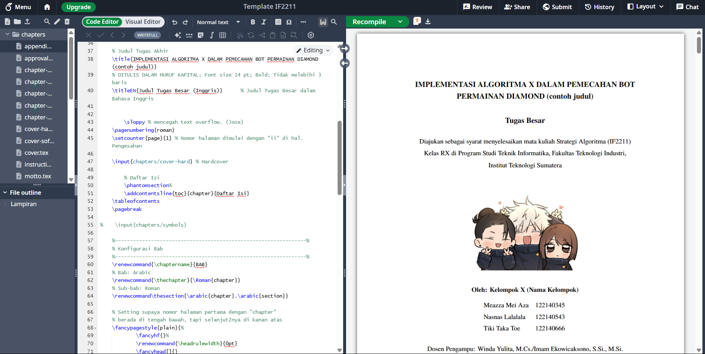

# LaTeX-Template-Tubes-Strategi-Algoritma

Template LaTeX untuk Laporan Tugas Besar Mata Kuliah **Strategi Algoritma (IF2211)**  
Program Studi Teknik Informatika, Institut Teknologi Sumatera
[Preview versi Overleaf](https://www.overleaf.com/read/vnzbvyscpknp#7e3766)

> 📘 Dibuat oleh Asisten Perkuliahan Strategi Algoritma  
> 🎓 Terinspirasi dari Template Tugas Akhir Informatika ITERA

---

## 📌 Apa Ini?

Repositori ini berisi **template LaTeX resmi** untuk menyusun laporan Tugas Besar pada mata kuliah **Strategi Algoritma (IF2211)** di ITERA.  
Template ini disusun untuk membantu mahasiswa menyusun laporan yang terstruktur, rapi, dan sesuai standar akademik.

Template ini terinspirasi dari:
- Template Latex Tugas Akhir [Informatika ITERA](https://github.com/rdhnk/Latex-TA-IF-ITERA/blob/main/thesis.tex)
- Template Microsoft Word Tugas Akhir Informatika ITERA
- [Templat LaTeX Tesis Informatika ITB](https://github.com/petrabarus/if-itb-latex) oleh Petra Barus & Peb Ruswono Aryan

---

